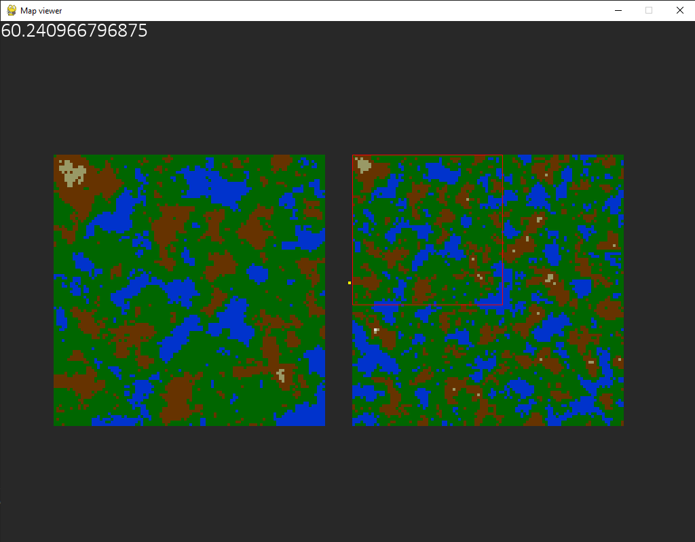
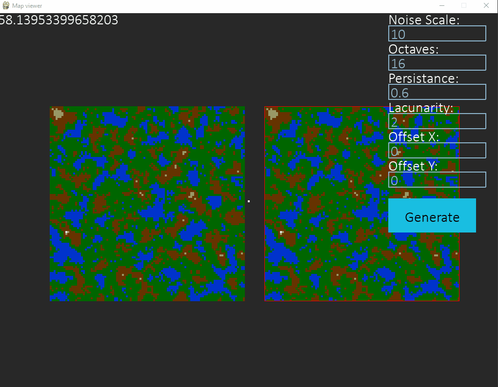
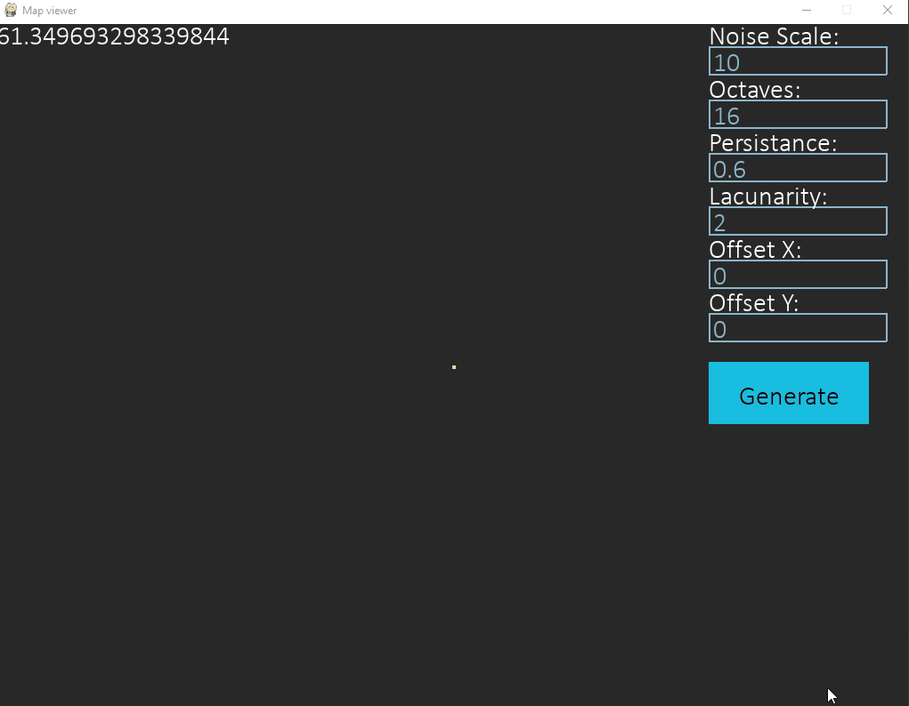

# NoiseMapGenerator
A python map generator using perlin noise.

Warning ahead, the code is not really clean and it runs slow with big maps, a 100x100 map usually runs pretty well.

The test_heights.py is a script to check the maximum and minimum height of the noise

# Installation, configuration and execution

First install [Python](https://www.python.org/) (I developed it with 3.9 but it should work in higher versions) do a `pip install -r requirements.txt` and it will do the rest

In case you want to modify any of the configurations you can change them modifying the settings.py

Then move to the map_generator folder and run main.py

Once it's done click generate with the settings you want and enjoy.

# Controls
`WASD` or `arrow keys` for moving the camera around

`h` to hide the menu on the right

`4862` and `+-` in the numpad to move the noise to the sides or increasing the zoom

# Images

## Preview of the map

## Generating a map with the settings we want

## Moving and zooming around the map

